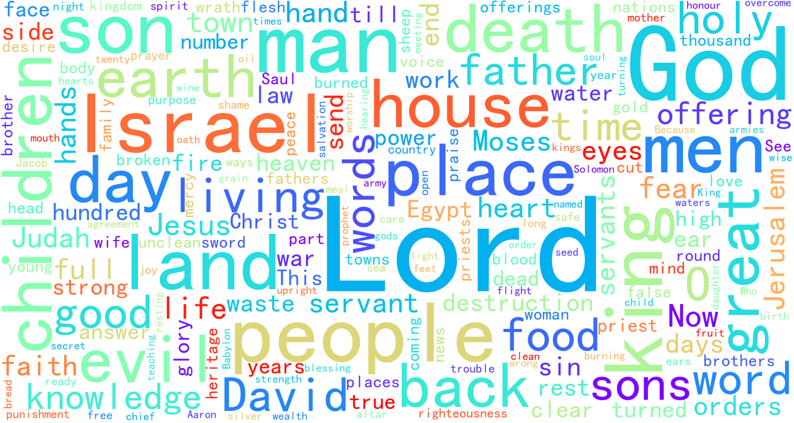

# Bible Word Cloud

## Overview

A project that combines word cloud visualization with biblical texts. This tool processes biblical texts by tokenizing words, removing stop words, and generating beautiful word cloud visualizations.

## Features

- [x] Data acquisition from multiple Bible versions
- [x] Chinese text tokenization using Jieba
- [x] Stop word filtering
- [x] Word frequency analysis
- [x] Word cloud generation (both static images and interactive HTML)
- [x] Performance profiling and logging

## Supported Bible Versions

- **BBE (Bible in Basic English)**
- **HGB (Chinese Union Version)**
- **KJV (King James Version)**
- **YLT (Young's Literal Translation)**

## Examples

BBE Version:


HGB Version:


Interactive HTML versions are also available in the `products/` directory.

## Quick Start

### Prerequisites

- Python 3.9+
- Conda (recommended) or pip

### Installation

```bash
# Using conda (recommended)
conda env create -f freeze.yml
conda activate web_ana

# Or using pip
pip install -r requirements.txt
```

### Running the Application

```bash
python main.py
```

This will generate both static PNG images and interactive HTML word clouds in the `out/` directory.

## Project Structure

```
bible_word_cloud/
├── main.py                 # Main entry point
├── src/
│   ├── gen_word_cloud.py      # Word cloud generation (static images)
│   ├── gen_word_cloud_echarts.py  # Interactive word clouds using ECharts
│   └── utils/
│       ├── gene_fold.py       # Directory creation utility
│       ├── mylog.py          # Logging configuration
│       └── timecalc.py       # Performance timing decorator
├── resources/
│   ├── *.txt               # Bible text files
│   └── stop_words.txt      # Stop words list
├── products/               # Generated output files
└── tests/                  # Test files
```

## Usage

The main script provides several functions:

- `gene_bbe(num)`: Generate multiple BBE version word clouds
- `gene_hgb(num)`: Generate multiple HGB version word clouds
- `gene_bbe_echarts()`: Generate interactive BBE word cloud HTML
- `gene_hgb_echarts()`: Generate interactive HGB word cloud HTML

## Contributing

We welcome contributions! Please follow these steps:

1. Fork the repository
2. Create a feature branch (`Feat_xxx`)
3. Commit your changes
4. Create a Pull Request

## Issue Reporting

Please submit any issues or bug reports in the GitHub Issues section.

## License

This project is licensed under the Mulan PSL v2 License. See [LICENSE](LICENSE) for details.

## Acknowledgements

- Bible text sources:
  - <https://o-bible.com/gb/dlb.html>
  - <https://biblehub.net/>
  - <https://openbible.com/downloads.htm>
  - <http://www.jdtxj.love/thread-33746-1-1.html>
  - <https://www.biblesupersearch.com/bible-downloads/>
  - <https://www.biblesupersearch.com/2018/03/a-brief-summary-of-the-bible/>
- Jieba for Chinese text segmentation

## Technical Details

- **Text Processing**: Uses Jieba for Chinese word segmentation
- **Visualization**: Supports both static images (WordCloud) and interactive charts (PyECharts)
- **Performance**: Includes timing decorators for performance monitoring
- **Logging**: Comprehensive logging system for debugging and monitoring
