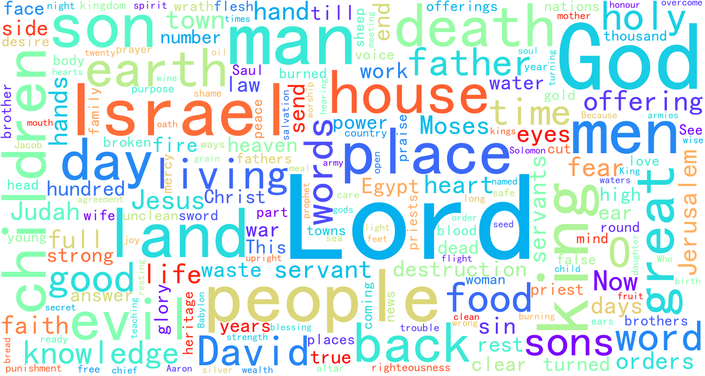

# bible_word_cloud

[English README](./README.en.md)

## 介绍

词云图和圣书的结合， 分词, 剔除停用词语后, 展示词云图.

## 特性

- [x] 数据获取
- [x] 分词
- [x] 剔除无效词
- [x] 展示图
- [x] 性能分析

## 示例

bbe版本：


hgb版本：


## 快速开始

```bash
# 安装
conda env create -f freeze.yml
# 运行
python main.py
```

## 参与贡献

- Fork 本仓库
- 新建 Feat_xxx 分支
- 提交代码
- 新建 Pull Request

## 问题反馈

在 GitHub Issues 中提交问题。

## 许可证

http://license.coscl.org.cn/MulanPSL2

## 致谢

- <https://o-bible.com/gb/dlb.html>
- <https://biblehub.net/>
- <https://openbible.com/downloads.htm>
- <http://www.jdtxj.love/thread-33746-1-1.html>
- <https://www.biblesupersearch.com/bible-downloads/>
- <https://www.biblesupersearch.com/2018/03/a-brief-summary-of-the-bible/>

感谢平台提供的下载
